# CarrotNetwork

CarrotNetwork was a Minecraft server I created and maintained between October 2025, and May 2026. The server was a compeditive server focused on a gamemode called Genraid. CarrotNetwork grew to up to 113 players, and maintained over 100 players for its most active season. Throughout this project, I was responsible for almost every single aspect of its development, maintainence and management. This includes the skripting, design, hosting and community management.

# Achievements
- Designed and developed CarrotNetwork and ran it over a 7 month period.
- Reaching 12,318 unique player joins, 234 discord members, and a peak of 113 concurrent players
- Wrote over 11,500 lines of Skript, and hundreds of additional lines across different plugins
- Implemented over 50 mechanics and features to the server
- Created a custom anticheat which could detect modded minecraft clients upon joining the server through a minecraft packet translation exploit, with a custom anticlip anticheat, which prevents teleporting through walls using exploits and cheats without ever recording a false positive flag
- Built a 1,400+ line python discord bot using discord APIs, webhooks, minecraft RCON, HTTP services, an account linking system between minecraft and discord
- Created a commuinication system between minecraft and discord which allowed players in-game to communicate with users in discord in real time.
- In-game moderation logs, chat logs, anticheat logs, punishments and server events to all be sent to the discord
- Developed a ticket system, staff application system, moderation logging, a transcript generator, account verification system, and staff management systems which reduced the manual amount of work required for moderation signifigantly
- Released 35 content full updates containing new game mechanics, balancing features, bug fixes, and extra features suggested by our community, with each update being pushed out between 1 and 5 days during it's actived development period
- Tweaked and balanced our economy system across 6 seasons while juggling the server stability and preventing major exploits through lots of beta testing and thought out code
- Successfully migrated the server from Minehut to an external hosting service after minehut was having some network wide infastructure issues, which improved server uptime, and performance
- Self funded development with an AUD$50 budget, growing the server into a profitable live community that generated approximately AUD$1,000 during its most successful season
- Actively listened to my community through a player feedback system, discord polls, suggestion additions, support tickets, and direct interaction with the playerbase which all guided the future development of the server.

## Project Statistics

- Development started: September 2025
- Public operation: 6 months
- Seasons released: 6
- Total player joins: 12,318
- Peak concurrent players: 113
- Discord members: 234
- Major updates released: 35
- Custom gameplay systems: 50+
- Skript code written: 11,511 lines
- Discord bot code written: 1,401 lines
- Hosting budget: AUD $50 initial investment
- Highest season revenue: ~AUD $1,070

## Technical Architecture

The server consisted of many systems:

- Minecraft Server (PurpurMC 1.21.11)
- Custom Skript made mechanics
- Skript Addons
- Python Discord bot
- Discord API integration
- Discord Webhooks
- Minecraft RCON
- Custom aiohttp services
- Vulcan AntiCheat integration
- MC-Heads API integration

These systems all worked with each other to create account linking, moderation logging, tickets, applications, discord to minecraft communication bridge, anti-cheat alerts, and management features.

## My Role

As the owner CarrotNetwork, and the only developer working solo, I was responsible for:

- Design and balancing
- Skript development
- Anti-cheat development
- Discord bot development
- Infastructure management
- Hosting migration
- Community management
- Staff management
- Feature planning and testing

## Why I built CarrotNetwork
I began the development of CarrotNetwork back in september of 2025. Previously to the development of CarrotNetwork, I was often hosting survival minecraft servers for me and my friends. I would always manage it, add custom features, and keep it stable. I always wanted to work on something like CarrotNetwork, and after some thinking with one of my good friends who later became the manager of this project, I began development on CarrotNetwork. This project I never intended on making money on. I started this project for fun, and hoped for it to gain some popularity, like an average Minehut server. It was unexpected when back in season 2, we were averaging over 100 players daily. This spike caused me to spend countless nights working on features, fixing bugs, helping members, managing staff, and much more. Juggling this project, along with spending time with my family and school was too much, which caused me to slowly become less active in my community and the development of CarrotNetwork. I knew the time had come, in which I shut down CarrotNetwork. I am proud of how well it did, what I learned from it, and the friends I made when developing this project. I intend on starting it backup in the future when I have more time and money on my hands, but for now, I put it down to rest.

## Screenshots

### World & Gameplay

#### Spawn

#### Map

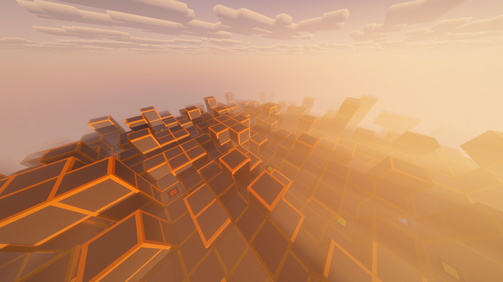

#### Main Lobby

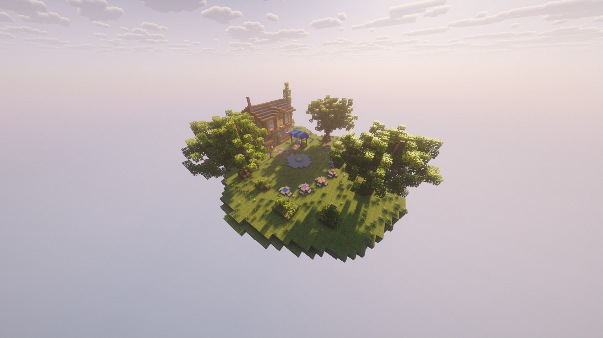

#### Meteor Shower Event

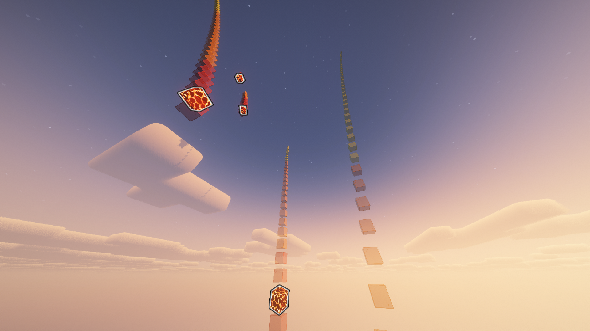

### GUIs

#### Shop GUI

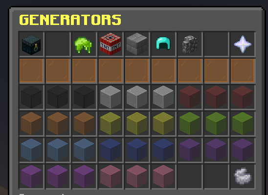

#### Carrot Store

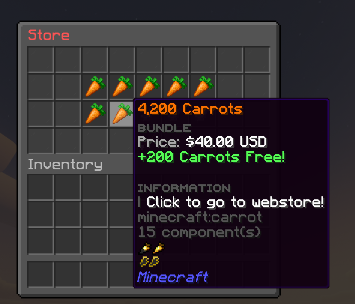

#### Crate Store

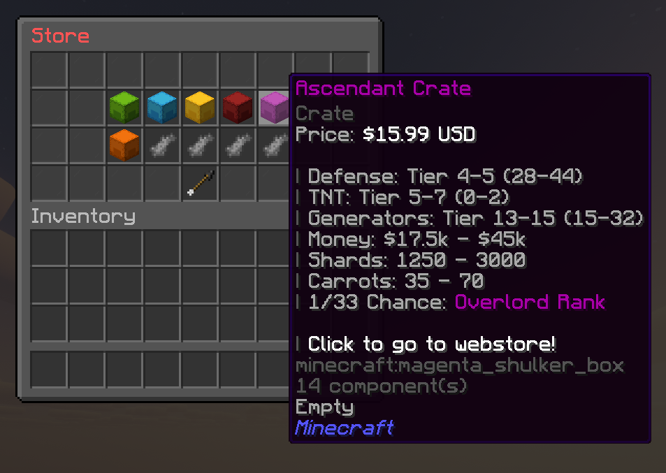

#### Rank Store

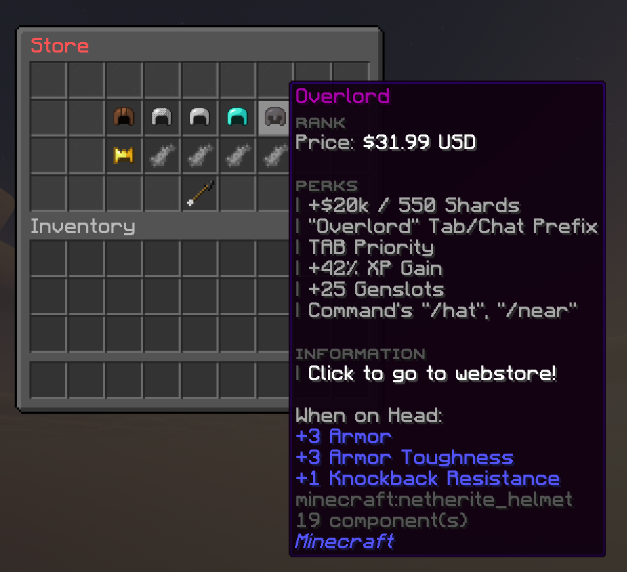

### Discord Integration

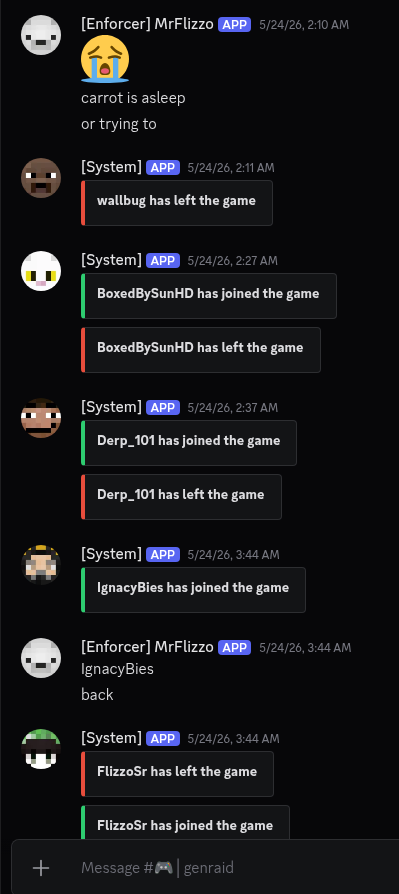

#### Automated Punishment Logging

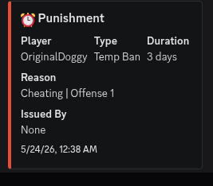

#### Staff Punishment Verification

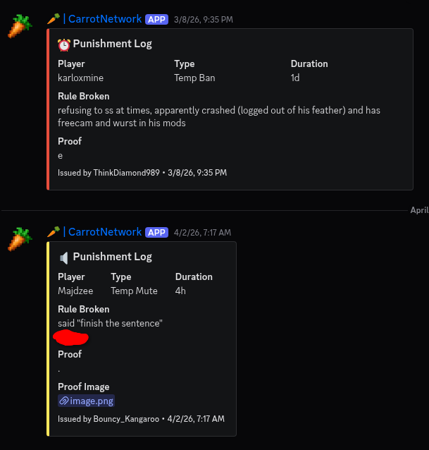

#### Staff Application System

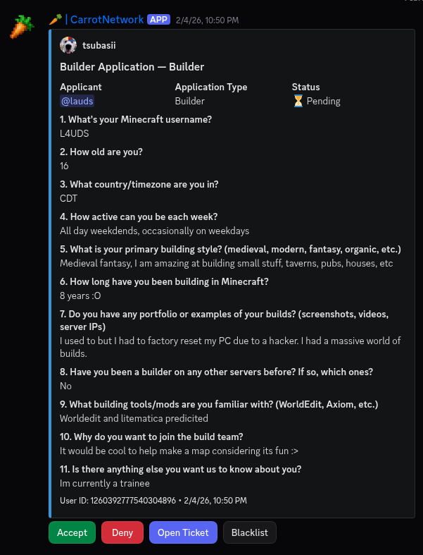

## Challenges Faced

### Infrastructure Migration

After Minehut experienced reliability issues, I moved the server to an external hosting service while maintaining all player data and reducing downtime as much as possible.

### Anti-Cheat Development

I developed a packet based anti cheat system which could detecting modded clients, including all of their modifications which they had enabled, and a movement anticheat which prevented all wall clipping cheats while minimizing all false positives.

### Community Scaling

As the server grew, I automated moderation, support, and communication to reduce staff workload.

## Lessons Learned

Running CarrotNetwork taught me:

- How to manage a service with actual users.
- How to gather and implement community feedback.
- How to design and devlop mechanics which I could use long-term.
- How to integrate multiple different languages and technologies into a single platform.
- How to balance features, minimise bugs, and maintain server stability.
- How much harder long-term project maintenance can become compared to the first part of development.
